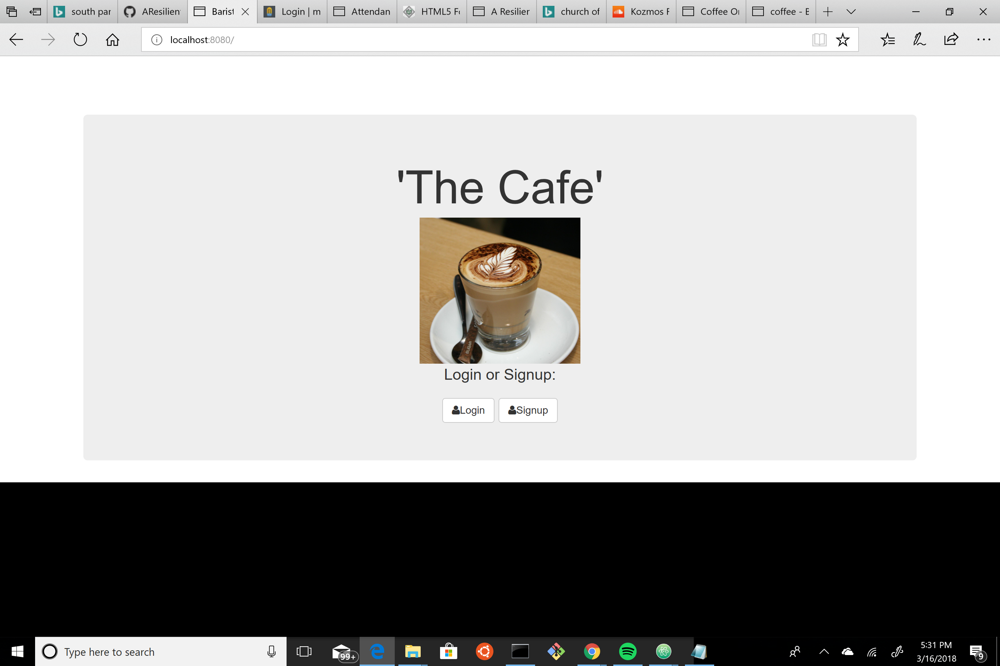
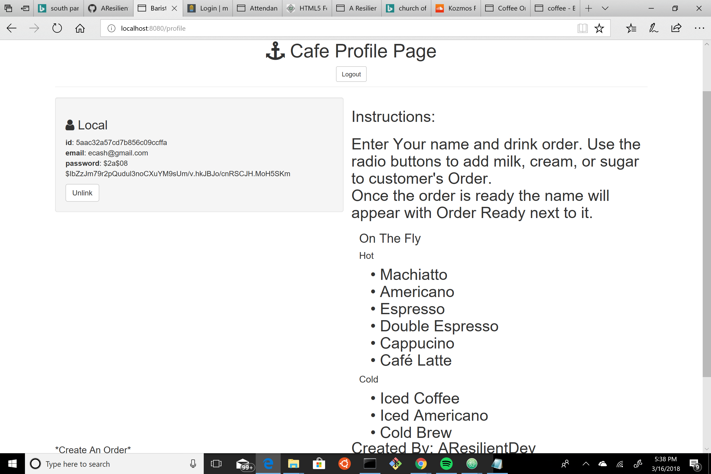

My Awesome Project
a full stack application with local user authentication users are able to choose their size and type of coffee along with other options (see screenshot 2)

How It's Made:
Tech used: HTML, CSS, JavaScript, Express.js, Node.js, Ejs, Passport

Lessons Learned:
This is a project that I worked on in order to solidify my understanding of passport authentication, and I must say that it succeeded in it's task. I am now more comfortable with passport than I was when I began this project I have a better understanding of the concepts it implements and was able subsequently apply what I learned to a project of my own.       

## Installation

1. Clone repo
2. run `npm install`

## Usage

1. run `node server.js`
2. Navigate to `localhost:8080`

## Credit

Modified from Scotch.io's auth tutorial
